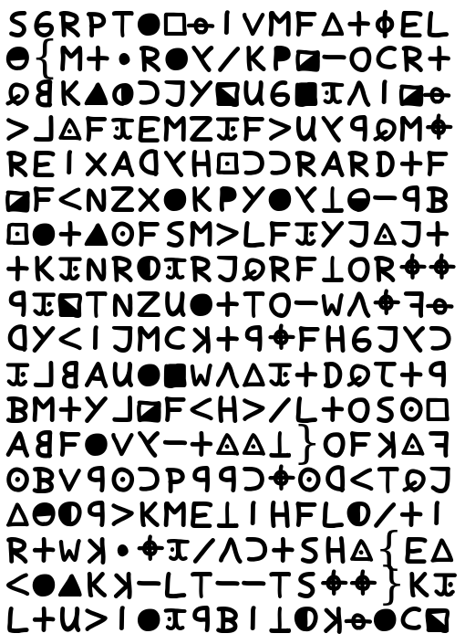
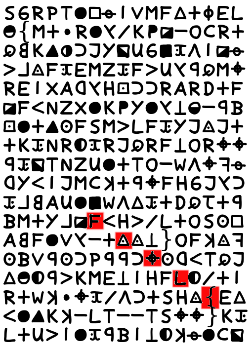
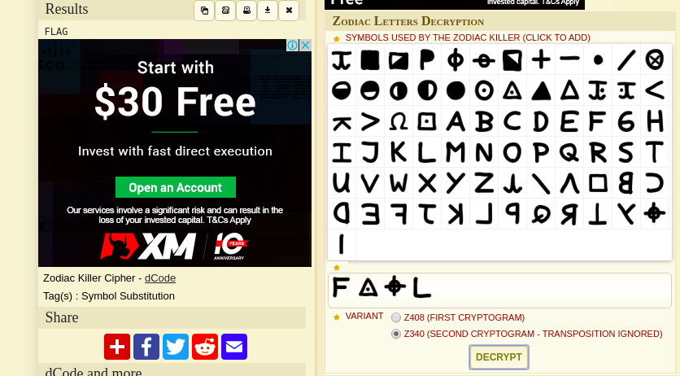
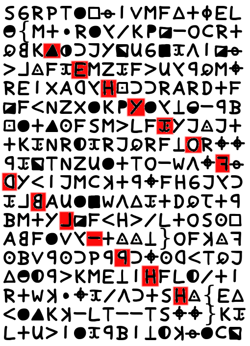
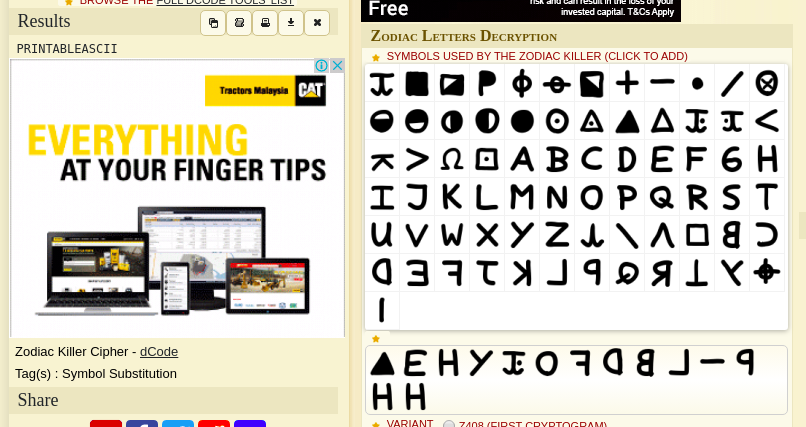
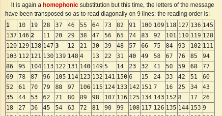
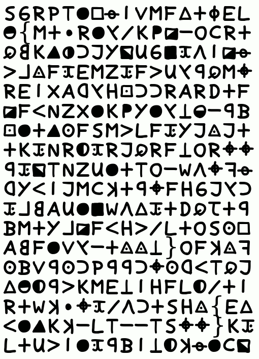
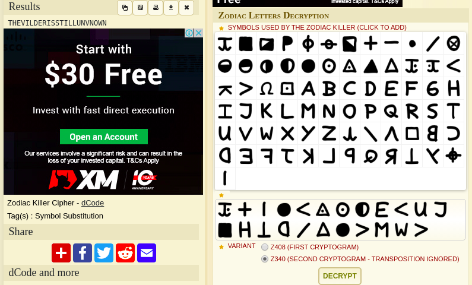
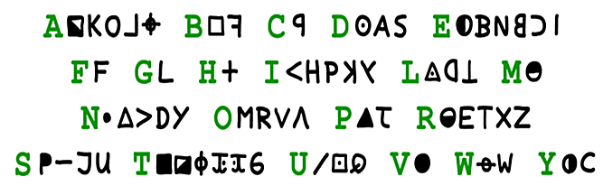

# Star Sign 🌌
```
Cyku works at Big-Middle-Sky Newspaper, today she receive a strange letter, can you help her find out what it says?

Note: The flag format is FLAG{A-Z}

http://eof01.zoolab.org:40000/

Author: FI
```
Go to http://eof01.zoolab.org:40000/ (Website is down now)

You will see title **Z306** and a bunch of character like this:



This remind me of a news about a killer long time ago: [Zodiac killer](https://en.wikipedia.org/wiki/Zodiac_Killer)

And his 340-character cipher have cracked recently by three people from the US, Belgium and Australia. [Youtube video](https://youtu.be/-1oQLPRE21o)

His cipher looks very similar to this challenge:


And the title **Z306** also indicate that (his cipher called Z340)

His cipher used [homophonic substitution](http://practicalcryptography.com/ciphers/homophonic-substitution-cipher/) + [transpostion](https://en.wikipedia.org/wiki/Transposition_cipher)

## Solving

I used this [website](https://www.dcode.fr/zodiac-killer-cipher) to help me solve it

The flag format is `FLAG{A-Z}`

You can see got the flag format inside the cipher follow "knight move":





I notice got two flag inside (Bacause got two `{` and `}`)

Then I highlight one to decrypt:



It decrypted as `PRINTABLEASCII`



But I submit is not the flag =(, need to decrypt another one

This one is abit tricky, I follow the table in dcode.fr:



It can split into two parts, first part is 1-9th row, second part is 10-18th row

Create a simple animation for the arrangement:



It decrypted as `THEVILDERISSTILLUNVNOWN`



The decrypted flag looks not correct..

Then I change to `THEKILLERISSTILLUNKNOWN` because it makes more sense

I think because the original cipher doesn't have `K` letter:



Thats it! Quite fun challenge

## Flag
> FLAG{THEKILLERISSTILLUNKNOWN}